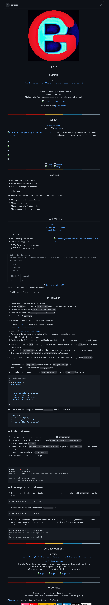
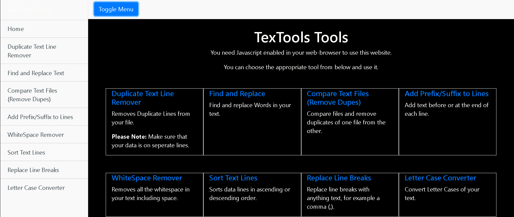
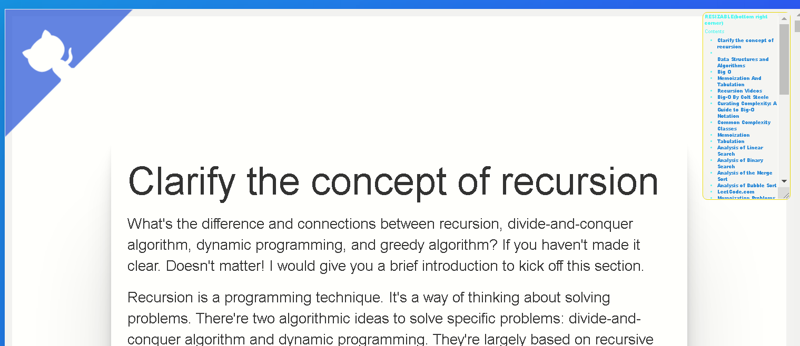

-testing
<!-- HEADER -->
<div align="center">

  <!-- SHIELDS -->
  <!-- For how-to notes on shield badges, see docs: https://shields.io/ -->


 


# MY WEB-DEV UTILITIES NPM PACKAGE


### This code is not exclusivley written by me ... it is just a list of files I use often during website development... use at your own risk


## Copy-2-Clipboard:


---

## Git-Html Preview-Tool:


---

## Markdown Templates:



---

## Text Tools:




---

## Automatic Table Of Contents Generator:




---

## Text-File-2-JS-Array:


---

### Usage:

```bash 
npm i web-dev-utils
```

</div>
---

```
.
├── ./Auto-table-Of-Contents
│   ├── ./Auto-table-Of-Contents/toc.css
│   └── ./Auto-table-Of-Contents/toc.js
├── ./LICENSE
├── ./README.md
├── ./TREE.md
├── ./bash-scripts
│   ├── ./bash-scripts/APPEND-DIR.js
│   ├── ./bash-scripts/Download-all-weblinks-of-certain-file-type.sh
│   ├── ./bash-scripts/Download-website.sh
│   ├── ./bash-scripts/File_Transfer.sh
│   ├── ./bash-scripts/Recursively-remove-files-byname.sh
│   ├── ./bash-scripts/Recursively-remove-folders-byname.sh
│   ├── ./bash-scripts/Recusrive-npm-install.sh
│   ├── ./bash-scripts/Remove-script-tags-from-html.sh
│   ├── ./bash-scripts/Resursivleydeletenodemodules.sh
│   ├── ./bash-scripts/Sanatize-directory.sh
│   ├── ./bash-scripts/Windows-WSL-Postgres-terminal-prompt-command.sh
│   ├── ./bash-scripts/add-extension-to-files-in-folder.sh
│   ├── ./bash-scripts/add-text-2-end-of-file.sh
│   ├── ./bash-scripts/batch-download-videos.sh
│   ├── ./bash-scripts/change-file-extensions.sh
│   ├── ./bash-scripts/clone-folder-structure-populate-with-specific-file-type.sh
│   ├── ./bash-scripts/clone-folder-structure-without-files.sh
│   ├── ./bash-scripts/concatinate-all-html-files.sh
│   ├── ./bash-scripts/concatinate-markdown-files-to-single-html.sh
│   ├── ./bash-scripts/convert-html-2-md.sh
│   ├── ./bash-scripts/convert-markdown-2-html.sh
│   ├── ./bash-scripts/create-dummy-text-file-4-every-subfolder.sh
│   ├── ./bash-scripts/delete-files-bigger-than.sh
│   ├── ./bash-scripts/delete-git-files.sh
│   ├── ./bash-scripts/delete-zip.sh
│   ├── ./bash-scripts/generate-directory-index.html-from-files-in-working-directory.sh
│   ├── ./bash-scripts/get-links-from-webpage.sh
│   ├── ./bash-scripts/gistfile1.txt
│   ├── ./bash-scripts/git-filter-branch.sh
│   ├── ./bash-scripts/list-html-files.sh
│   ├── ./bash-scripts/output.md
│   ├── ./bash-scripts/print-file-paths-recursive.sh
│   ├── ./bash-scripts/recursive-action.sh
│   ├── ./bash-scripts/recursive-remove-lines-contaning-string.sh
│   ├── ./bash-scripts/recursive-unzip.sh
│   ├── ./bash-scripts/recursivley-create-numbered-folders.sh
│   ├── ./bash-scripts/remember-git-credentials.sh
│   ├── ./bash-scripts/remove-invalid-characters-from-file-names.sh
│   ├── ./bash-scripts/remove-lines-contaning-string.sh
│   ├── ./bash-scripts/remove-space-from-filenames.sh
│   ├── ./bash-scripts/remove-string-from-file-names.sh
│   ├── ./bash-scripts/remove-trailing-whitespace-from-file-names.sh
│   ├── ./bash-scripts/remove-unnecessary-files-folders.sh
│   └── ./bash-scripts/right.html
├── ./commands.txt
├── ./copy-2-clip
│   ├── ./copy-2-clip/README.md
│   ├── ./copy-2-clip/copy-2-clip.css
│   ├── ./copy-2-clip/copy-2-clip.js
│   └── ./copy-2-clip/recursion.html
├── ./css
│   └── ./css/gradient.css
├── ./favicon.ico
├── ./img
│   ├── ./img/101948313_3560363123980817_2358876238887518208_n.jpg
│   ├── ./img/back.jpeg
│   ├── ./img/banner.jpg
│   ├── ./img/circle-cropped (2).png
│   ├── ./img/circle-cropped.png
│   ├── ./img/cool-background.png
│   ├── ./img/data-struc.gif
│   ├── ./img/data-struc2.gif
│   ├── ./img/doc1-2.-inverted.png
│   ├── ./img/doc1-2.png
│   ├── ./img/docs.png
│   ├── ./img/ds-algo.gif
│   ├── ./img/dtw.gif
│   ├── ./img/dtw.png
│   ├── ./img/git-html-preview.gif
│   ├── ./img/imageonline-co-overlayed-image - Copy.png
│   ├── ./img/imageonline-co-overlayed-image.png
│   ├── ./img/lambda-demo.gif
│   ├── ./img/lambda-demo1.gif
│   ├── ./img/links.gif
│   ├── ./img/logos
│   │   ├── ./img/logos/FINAL.mp4
│   │   ├── ./img/logos/FINAL.png
│   │   ├── ./img/logos/betterfit.PNG
│   │   ├── ./img/logos/betterfit_auto_x2_colored_toned.png
│   │   ├── ./img/logos/circle-cropped (1).png
│   │   ├── ./img/logos/circle-cropped.png
│   │   ├── ./img/logos/enhanced (1).mp4
│   │   ├── ./img/logos/enhanced (1).png
│   │   ├── ./img/logos/enhanced (1)_Trim.mp4
│   │   ├── ./img/logos/enhanced.png
│   │   ├── ./img/logos/final-logo.png
│   │   ├── ./img/logos/iconified
│   │   │   ├── ./img/logos/iconified/apple-touch-icon-114x114.png
│   │   │   ├── ./img/logos/iconified/apple-touch-icon-120x120.png
│   │   │   ├── ./img/logos/iconified/apple-touch-icon-144x144.png
│   │   │   ├── ./img/logos/iconified/apple-touch-icon-152x152.png
│   │   │   ├── ./img/logos/iconified/apple-touch-icon-180x180.png
│   │   │   ├── ./img/logos/iconified/apple-touch-icon-57x57.png
│   │   │   ├── ./img/logos/iconified/apple-touch-icon-72x72.png
│   │   │   ├── ./img/logos/iconified/apple-touch-icon-76x76.png
│   │   │   ├── ./img/logos/iconified/apple-touch-icon.png
│   │   │   ├── ./img/logos/iconified/favicon.ico
│   │   │   └── ./img/logos/iconified/iconifier-readme.txt
│   │   ├── ./img/logos/logo (1).png
│   │   ├── ./img/logos/logo-animated (1).gif
│   │   ├── ./img/logos/logo-animated (1).jpg
│   │   ├── ./img/logos/logo-animated.mp4
│   │   ├── ./img/logos/logo-final-touchup.PNG
│   │   ├── ./img/logos/logo.PNG
│   │   ├── ./img/logos/logo_auto_x1.png
│   │   ├── ./img/logos/logo_auto_x1_auto_x2_colored_toned.png
│   │   ├── ./img/logos/mini-logo.png
│   │   └── ./img/logos/techniwave-logo.jpg
│   ├── ./img/mihir2.gif
│   ├── ./img/mihirbeg.gif
│   ├── ./img/music-profile.PNG
│   ├── ./img/my-back.png
│   ├── ./img/my-websites
│   │   ├── ./img/my-websites/1eb83ff46da1f1bf9d4227bd663a6c54.png
│   │   ├── ./img/my-websites/21ecc2f26e2641c8e9aae5479481bbe2 (3).png
│   │   ├── ./img/my-websites/21ecc2f26e2641c8e9aae5479481bbe2 (5).png
│   │   ├── ./img/my-websites/27697c1a901d3b3673aeb98edae4d2ae (2).png
│   │   ├── ./img/my-websites/51485b6b1a74262e7478709b66e0dd23 (4).png
│   │   ├── ./img/my-websites/5307d1df23eb389bb31a6cfe43def861 (5).png
│   │   ├── ./img/my-websites/53bd97097fd4a60cb9d6dce85fefabe8 (5).png
│   │   ├── ./img/my-websites/7a8bc98e902a2f6dea90386cdfb154c2.png
│   │   ├── ./img/my-websites/a1fe9eb14f2473255f3a7050b74f303b (1).jpg
│   │   ├── ./img/my-websites/bb090e30d34aa476398902baf0527dc3 (1).jpg
│   │   ├── ./img/my-websites/bb090e30d34aa476398902baf0527dc3 (3).jpg
│   │   ├── ./img/my-websites/e52475b93e4c589140a961f6ec6a8d7e (4).png
│   │   ├── ./img/my-websites/e8fe6085906d342bb17186bf6616a6cf.png
│   │   ├── ./img/my-websites/fdc8babfb876d5238b83ffaf876dc0dd (4).png
│   │   └── ./img/my-websites/fdc8babfb876d5238b83ffaf876dc0dd.png
│   ├── ./img/noo.jpg
│   ├── ./img/posts.PNG
│   ├── ./img/pure-data.png
│   ├── ./img/python.png
│   ├── ./img/react.gif
│   ├── ./img/sine-wav-bak.gif
│   ├── ./img/skills - Copy.png
│   ├── ./img/skills.png
│   ├── ./img/social.png
│   ├── ./img/space.gif
│   └── ./img/svg-logos
│       └── ./img/svg-logos/logo-mibile.svg
├── ./js
│   ├── ./js/streetNames.txt
│   ├── ./js/streetNames.txt.js
│   └── ./js/textfile2Array.js
├── ./makefile
├── ./markdown-templates
│   ├── ./markdown-templates/BLANK_README.md
│   ├── ./markdown-templates/MAIN-README.md
│   ├── ./markdown-templates/README.md
│   ├── ./markdown-templates/Standard-Project-README.md
│   ├── ./markdown-templates/alt-README.md
│   ├── ./markdown-templates/filled-out-readme.md
│   ├── ./markdown-templates/images
│   │   ├── ./markdown-templates/images/logo.png
│   │   └── ./markdown-templates/images/screenshot.png
│   ├── ./markdown-templates/notes-template.md
│   └── ./markdown-templates/readme-alt-2.md
├── ./package-lock.json
├── ./package.json
├── ./prism
│   ├── ./prism/prism.css
│   └── ./prism/prism.js
├── ./python-scripts
└── ./robots.txt

14 directories, 157 files


81 directories
```
